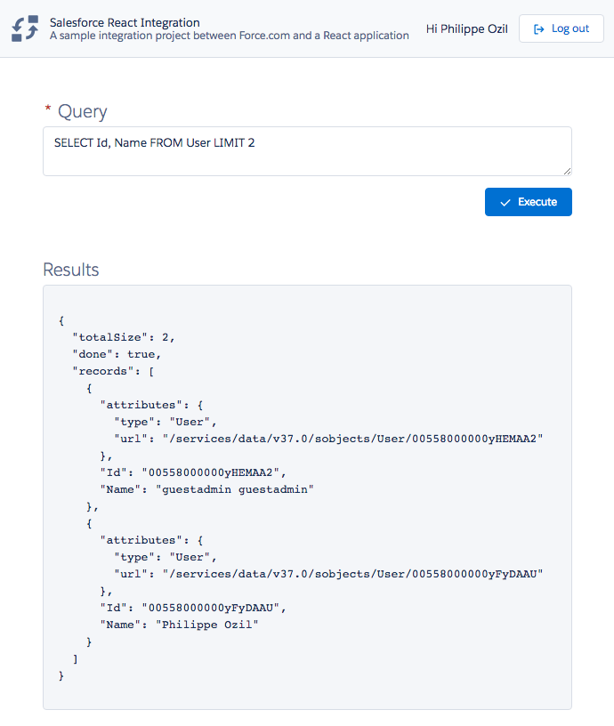

# Salesforce React integration

## About

Sample integration project between Salesforce and a React application.

This app demonstrates the following concepts:

- using [JSforce](https://jsforce.github.io) as a Salesforce client
  - authenticating with OAuth 2.0 (login, logout, retrieving session info)
  - using the REST API to run a SOQL query
- using the [Lightning Design System](https://www.lightningdesignsystem.com) (LDS) in a React application (all the CSS and icons of this app are provided by LDS)

The source code of this app is structured in the following way:

- the `client` directory holds the React app
- the `server` directory holds the node.js app that acts as a middleware with the Salesforce Platform

If you are building a React app with LDS, consider using the [React LDS base components](https://react.lightningdesignsystem.com/).

## Installation

1. cp dot.env to `.env` file in the root directory of this project and add this content (make sure to replace the values):

   ```
   consumerKey='YOUR_CLIENT_KEY'
   consumerSecret='YOUR_CLIENT_SECRET'
   username='USER_NAME'
   password='PASSWORD'
   apiVersion='53.0'

   isHttps='false'
   sessionSecretKey='A_SECRET_STRING'
   ```

2. Run `yarn install` to install dependencies.

3. Run `yarn build` to build the app.

4. Run `yarn start` to start the app.

## Screenshots

<div align="center">
	
</div>
